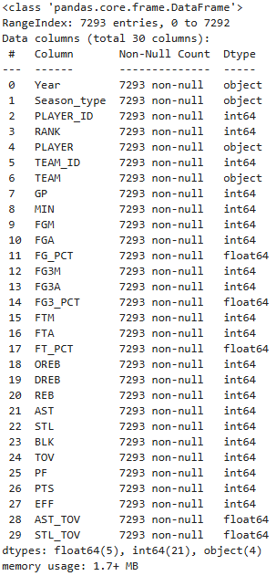
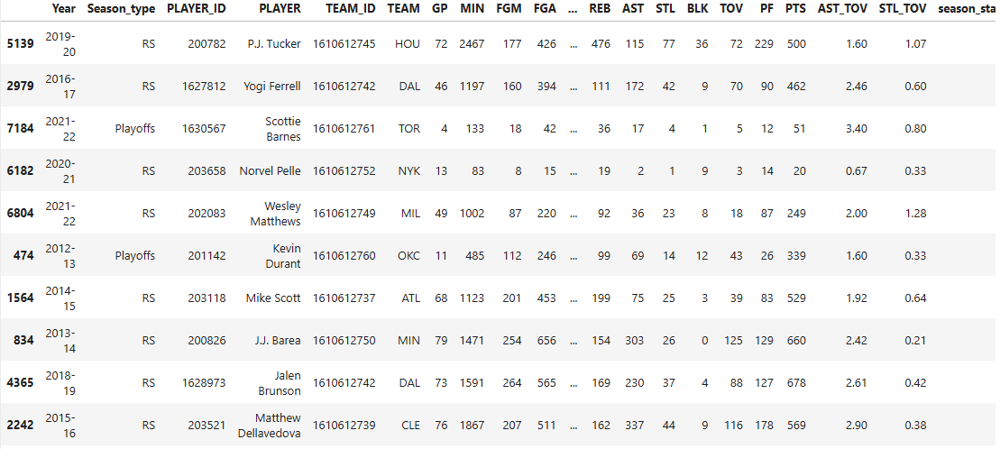
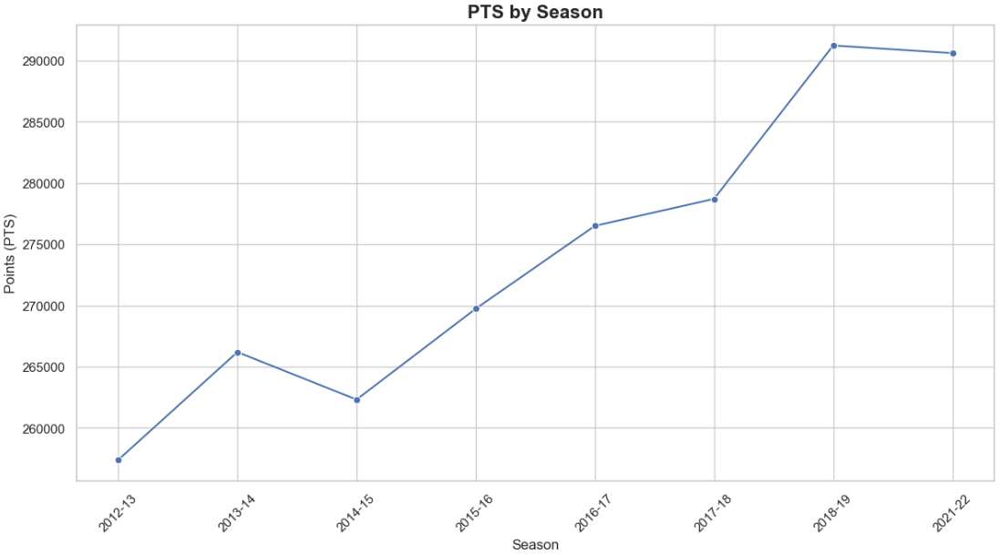

# NBA Scoring Evolution Analysis
## Introduction
It is well known that NBA players are constantly improving. The question begs, how rapidly are they improving? What exactly is causing the NBA's rapidly improving offensive efficiency?
This is a short project where I answer those two questions. This project utilizes Pandas and Numpy to view, clean and manipulate the data, as well as matplotlib to visualize results.  

The dataset I used was scraped from the NBA's official stats page: [https://www.nba.com/stats/leaders](url). The scraping process is documented in the **stats scraping.ipynb** file.
I also saved the full dataset as an Excel file, **nba_player_data.xlsx**. 
This dataset includes the total stats for each player from the 2012-13 season through the 2021-22 season, with individual stats recorded seperately for each season.

## Cleaning the Data

### First Inspection
Upon first inspection of the data, we can observe that it is already fairly clean. 
It seems there are no non-null values and most, if not all columns are of the right type.
Although, there are a couple of minor changes we can make to make analysis easier:  
1. Drop the 'RANK' (Player Ranking) and 'EFF' (Efficiency) columns, as we will not need them for our analysis
2. Add a column with the starting year of each season, to make the 'Year' (season) column easier to reference
3. In the 'TEAM' column, merge 'NOH' and 'NOP' to one team (New Orleans changed their team name)
4. In the 'Season_type' column, rename 'Regular%20Season'         

### Organizing the Data
Now that our data is ready for analysis, we organize our data further to ensure more efficient analysis:
- Seperate the dataframes by regular season and playoffs
- Add column names that are subject to future aggregation to an array for future reference

## Analysis
We begin by calculating the following stats for each individual season, which are each stored in seperate dictionaries:
- Total FGM (field goals made)
- Total 3PM (three pointers made)
- Total 3PA (three pointers attempted)
- Total points scored

Note: Keys represent the year the season started

We then create a dataframe with our dictionaries, which will be used to plot more efficiently.

### Inspection
Just by looking at our new dataframe, we can already begin to make some key observations:
1. Total FGM steadily increases, and suddenly plummets during the 2019-20 and 2020-21 seasons
2. 3PA increases rapidly, but once again declines during the 2019-20 and 2020-21 seasons
3. 3PM & PTS are increasing, but also decline during the same period

These declines during the 2019-20 and 2020-21 seasons are likely due to covid, which shortened both of those seasons.
Because of this, we will remove these rows from the dataframe to maintain accuracy and consistency of our analysis.

Finally, we calculate the total 3P% (three point field goal percentage) for each season, as well as a dataframe for the change
in FGM, 3PA, 3PM, and PTS from the previous season, which we will use in the future to calculate maximum increase and average increase.

### Points Scored
From the plot below, we can see the total points scored has been increasing rapidly throughout the seasons.
-
